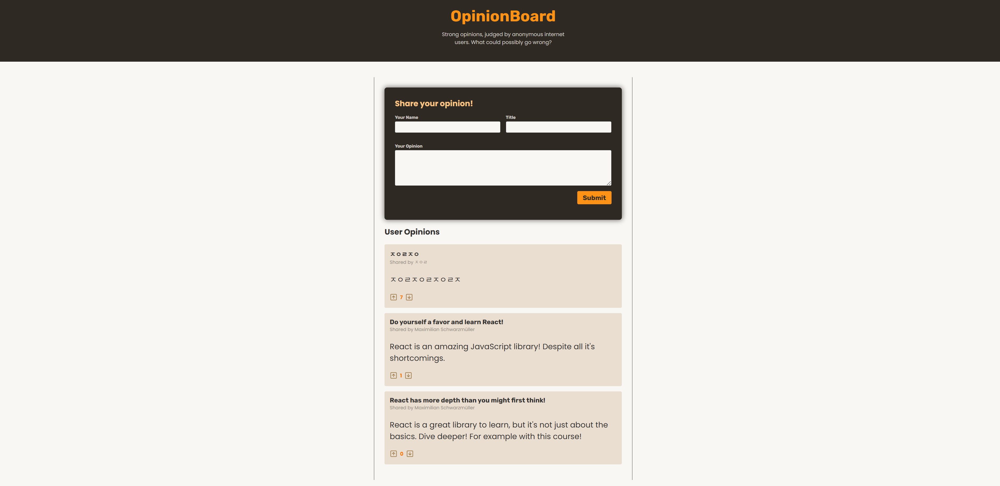

# React Form Actions 학습 프로젝트



## 📋 프로젝트 개요

이 프로젝트는 React 19의 새로운 Form Actions 기능을 학습하기 위한 의견 공유 애플리케이션입니다. 사용자들이 의견을 작성하고, 투표할 수 있는 기능을 제공합니다.

## 🎯 학습 목표

React 19에서 도입된 다음 핵심 개념들을 실습합니다:

### 1. Form Actions

- **`useActionState`** 훅을 사용한 폼 상태 관리
- **Server Actions** 패턴을 통한 폼 처리
- 폼 검증 및 에러 처리

### 2. Form Status

- **`useFormStatus`** 훅을 사용한 폼 제출 상태 추적
- 제출 중 버튼 비활성화 및 로딩 상태 표시

### 3. Optimistic Updates

- **`useOptimistic`** 훅을 사용한 낙관적 업데이트
- 사용자 경험 향상을 위한 즉시 UI 반영

## 🛠️ 기술 스택

### Frontend

- **React 19.1.0** - 최신 React 버전 사용
- **Vite** - 빠른 개발 환경
- **Modern React Hooks**:
  - `useActionState`
  - `useFormStatus`
  - `useOptimistic`
  - `use`

### Backend

- **Node.js + Express** - RESTful API 서버
- **JSON 파일 기반 데이터 저장**

## 🔧 주요 구현 내용

### 1. 의견 작성 폼 (NewOpinion.jsx)

```jsx
// useActionState를 사용한 폼 액션 정의
const [formState, formAction] = useActionState(shareOpinionAction, {
  errors: null,
});

// 서버 액션 함수
async function shareOpinionAction(prevState, formData) {
  // 폼 데이터 추출
  const title = formData.get("title");
  const body = formData.get("body");
  const userName = formData.get("userName");

  // 검증 로직
  const errors = [];
  if (title.trim().length < 5) {
    errors.push("Title must be at least 5 characters long.");
  }

  // 에러가 있으면 에러 상태 반환
  if (errors.length > 0) {
    return { errors, enteredValues: { title, body, userName } };
  }

  // 성공 시 의견 추가
  await addOpinion({ title, body, userName });
  return { errors: null };
}
```

**주요 학습 포인트:**

- `FormData` API를 사용한 폼 데이터 추출
- 클라이언트 사이드 검증
- 에러 상태와 입력값 유지
- `defaultValue`를 사용한 폼 상태 복원

### 2. 제출 버튼 상태 관리 (Submit.jsx)

```jsx
import { useFormStatus } from "react-dom";

export default function Submit() {
  const { pending } = useFormStatus();

  return (
    <button type="submit" disabled={pending}>
      {pending ? "Submitting..." : "Submit"}
    </button>
  );
}
```

**주요 학습 포인트:**

- `useFormStatus`로 폼 제출 상태 추적
- 제출 중 버튼 비활성화
- 로딩 상태 UI 표시

### 3. 낙관적 업데이트 (Opinion.jsx)

```jsx
// 낙관적 업데이트 훅 사용
const [optimisticVotes, setVotesOptimistically] = useOptimistic(
  votes,
  (prevVotes, mode) => (mode === "up" ? prevVotes + 1 : prevVotes - 1)
);

// 투표 액션
async function upvoteAction() {
  setVotesOptimistically("up"); // 즉시 UI 업데이트
  await upvoteOpinion(id); // 서버 요청
}

// 액션 상태 관리
const [upvoteFormState, upvoteFormAction, upvotePending] =
  useActionState(upvoteAction);
```

**주요 학습 포인트:**

- `useOptimistic`을 사용한 즉시 UI 반영
- 서버 응답 전에 사용자 경험 개선
- 액션 상태와 pending 상태 분리 관리

### 4. Context와 Form Actions 통합

```jsx
// Context에서 비동기 액션 제공
const { addOpinion, upvoteOpinion, downvoteOpinion } = use(OpinionsContext);

// Form Actions에서 Context 액션 호출
await addOpinion({ title, body, userName });
```

**주요 학습 포인트:**

- `use` 훅을 사용한 Context 접근
- Context와 Form Actions의 원활한 통합
- 상태 관리와 서버 통신 분리

## 🚀 실행 방법

### 1. 의존성 설치

```bash
# 프론트엔드 의존성 설치
npm install

# 백엔드 의존성 설치
cd backend
npm install
```

### 2. 서버 실행

```bash
# 백엔드 서버 시작 (http://localhost:3000)
cd backend
npm start

# 새 터미널에서 프론트엔드 개발 서버 시작
npm run dev
```

## 📂 프로젝트 구조

```
react-form-actions-2/
├── src/
│   ├── components/
│   │   ├── NewOpinion.jsx    # 의견 작성 폼 (useActionState)
│   │   ├── Submit.jsx        # 제출 버튼 (useFormStatus)
│   │   ├── Opinion.jsx       # 투표 기능 (useOptimistic)
│   │   ├── Opinions.jsx      # 의견 목록
│   │   └── Header.jsx        # 헤더
│   ├── store/
│   │   └── opinions-context.jsx  # Context API
│   └── App.jsx
├── backend/
│   ├── app.js               # Express 서버
│   ├── db.json             # 데이터 저장소
│   └── package.json
└── README.md
```

## 🎓 학습 성과

이 프로젝트를 통해 다음과 같은 React 19의 새로운 기능들을 실습했습니다:

1. **Form Actions의 실제 활용법**

   - 전통적인 이벤트 핸들러 대신 `action` 속성 사용
   - `useActionState`를 통한 폼 상태 관리

2. **사용자 경험 개선 기법**

   - `useFormStatus`로 로딩 상태 관리
   - `useOptimistic`으로 즉각적인 피드백 제공

3. **모던 React 패턴**

   - `use` 훅을 활용한 Context 접근
   - Server Actions 패턴 구현

4. **실용적인 폼 처리**
   - 클라이언트 사이드 검증
   - 에러 처리 및 사용자 입력 유지
   - FormData API 활용
